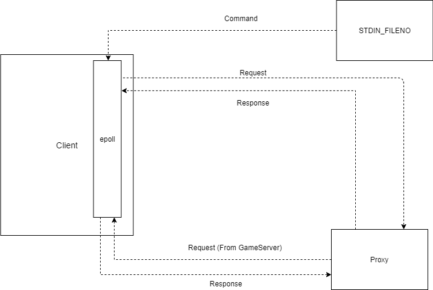

### Client 模块说明

#### 1. 模块配置

可以通过编辑 `client.config` 来配置 `Client` 的部分信息：

```
server 9.134.125.154	# 服务器ip地址
port 12345				# 服务器端口
log client.log			# log文件
```

#### 2.  运行

运行 `./Client config_path`  启动客户端，其中 `config_path`  是配置文件的路径

#### 3. 模块设计

客户端通过有限状态机来维护自身的多个状态，以此来过滤无效命令以及执行特定操作。有关客户端支持的命令描述以及状态转换关系详见 "客户端命令描述.md"

客户端可能接受来自终端的命令以及来自Game的请求（Bet, Hit 等），使用`epoll`来同时监听两者。Game的请求实际上由Proxy进行转发，客户端和Proxy通过TCP进行通信，并约定了如下的特定消息格式。

```
| message type (4 bytes) | message length (4 bytes) | message (variable) |
```



