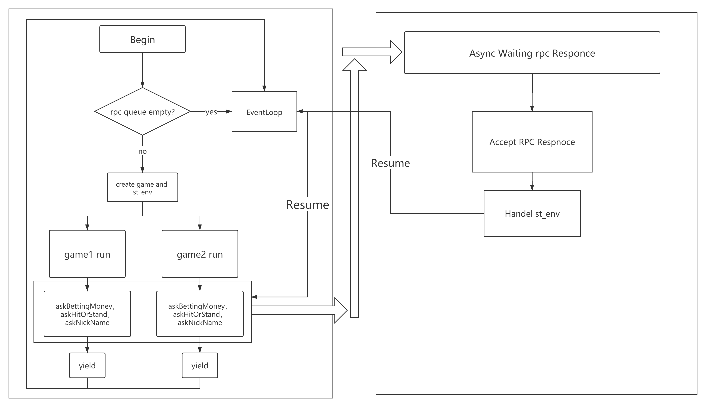

# GameService程序结构

#### 程序由三个线程组成。

* 线程1：主线程，用于

  1. 接收lobby的创建房间请求并用协程创建一个房间
  2. 接收用户的紧急信息，包括surrender，quit，double三种，并在接收后做出相应的动作
* 线程2：对于Proxy的请求响应用户线程，该线程主要用于
  1.当用户已经进入游戏，并创建了游戏协程后，向用户请求操作时等待相应的异步callback调用
* 线程3：对于Database的请求相应线程，该线程主要用于
  1.当用户已经进入游戏，创建了游戏协程后，做的第一件事就是向database请求用户的nickname，该操作应当是异步的

#### 线程之间的race condition

```
三个线程之间的通信主要是用一个自定义的类 stEnv_t
```

```
struct stEnv_t
{
    typedef std::shared_ptr<stEnv_t> ptr;
    stCoRoutine_t *coRoutine; //协程句柄
    BlackJackRoomID roomID;   //创建的房间号
    UidList &uids;            //所有玩家的uid
    int cond;                 //信号量
    OperateID operateId;      //操作码
    void *arg;                //操作数
    unsigned int sizeOfCompleteBetting = 0;
    stEnv_t(BlackJackRoomID _roomID, UidList &_uids) : roomID(_roomID), uids(_uids){};

    std::mutex mutex;
};
```

```
对于每一个创建的游戏对局，都会生成一个全新的stEnv_t，在游戏过程中要进行的状态迁移也由st_Env记录。因此在多个线程对stEnv进行操作时应当加mutex锁，避免st_Env的争用
```

#### 协程的使用

**各个协程之间的调度**

* 对于每一个对局而言，除了askBettingMoney，askHitOrStand，askNickName这三个操作，其他操作都是在一个协程内运行的，在除了进行这三个操作之外的其他用户代码，都不应当将协程切出，由于rpc server与游戏对局处于同一个线程当中，所有新的对局的信息都会在rpc的队列当中等待，只有在askBettingMoney，askHitOrStand，askNickName的等待期间，协程可以主动yield，这样所有的对局、grpc的server响应都可以在一个线程当中串行的进行。而由于协程本身将各个对局分离开来，每一个对局都有自己独立的stEnv_t句柄进行管理，因此各个对局之间在逻辑上来说是完全分开的

**线程之间的通信**

* 对于每一个yield掉的协程而言，唤醒其的唯二方法为
  1.超时
  2.接收到Client异步调用的返回信号
  由于Client的异步调用的返回是在另一个线程中进行的，因此应当考虑线程之间的通信。程序当中，对于每一个协程，都有一个模拟的信号量cond，在需要yield一个协程时，会使用poll函数关注这个cond，libco可配置其超时时间，因此在Client异步调用返回线程当中，可以通过写cond文件的方式唤醒协程，由于主线程中的所有协程对于cond只有读的操作（epoll_wait），而Client的异步调用对于cond只有有限较少的写操作，因此在此处可以不用加锁。

#### 线程、协程逻辑图



如上图，左框为主线程，右框为Client的异步线程

# 游戏流程

21点游戏流程相对比较简单，对于用户而言所涉及的操作只有设置筹码、停牌、抽牌、认输等几个有限的操作。

游戏的设计主要是使用了oop的思想，主要设计了Poker、Player、Room这三个类。

* 对于Room而言，每次initial或reset都会创建出一套新的random pokers ，设计reset的理由是游戏中的房间均有池来维护，使用reset可以不用重新去动态分配内存
* 对于Poker而言，每次initial或reset都会决定其是否为庄家（dealer），由于BlackJack游戏的各个模块是分开的，在lobby端就已经决定了谁是庄家，因此这边只要简单设计即可、
* 每一个Room都维护着一个PlayerList，这是一个shared_ptr的链表，使用智能指针的好处是可以自动的管理内存。
* 每一个player中都存储着Room的id，再通过hash表查询对应的Room对象，避免了对象的重复引用。
* 每一个player都维护着一个shared_ptr的poker链表
* 对于player而言有几个状态比较重要，他们分别是
  1. isStand	若isStand为true，那么后续对于该用户将完全忽略，知道最后判断该用户的胜负
  2. isQuit    若isQuit为true，那么游戏流程就会把该用户进行托管操作，接下来对用户的所有请求都以默认回复处理，而不主动yield
     * 玩家主动退出游戏----> isQuit = true
     * 玩家超时未响应------> isQuit = true

游戏的流程比较简单，也不怎么绕，具体流程请参照代码 createOneGame
