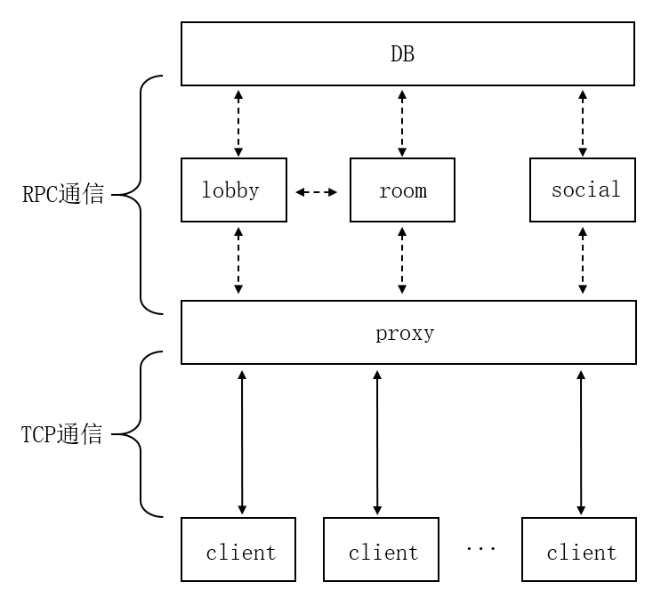
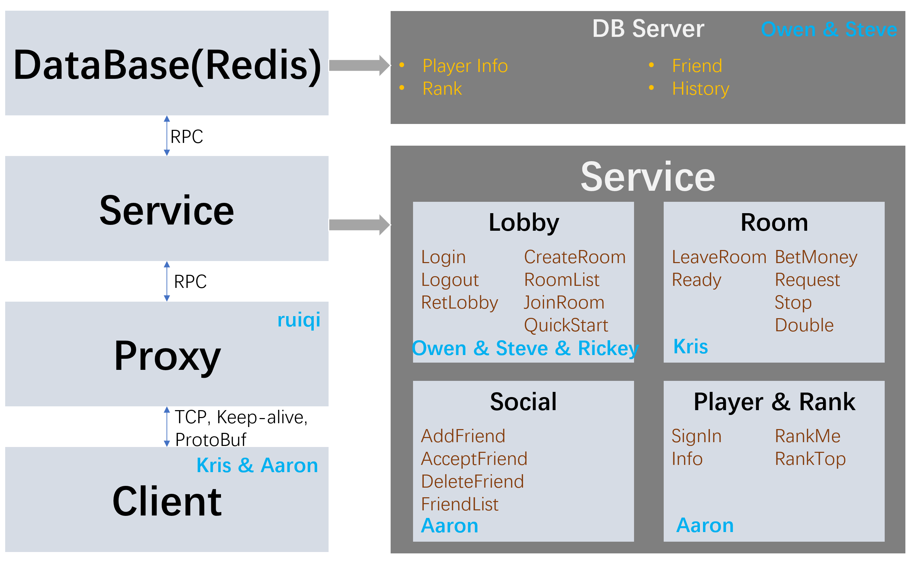

# Black Jack Back-end Server
An internship practicing project to design and build a back-end server for online Black Jack game.

## Server Framework

## Team members and division of work

The server is divided into six modules and each of them is assigned to certain members of the team. 

+ Front-end (Client): kristtong@tencent.com
+ Proxy: ruiqizhang@tencent.com
+ Lobby: owenybwei@tencent.com & stevejing@tencent.com
+ Room: kristtong@tencent.com
+ Social: aaronlv@kristtong@tencent.com
+ DB (database): owenybwei@tencent.com