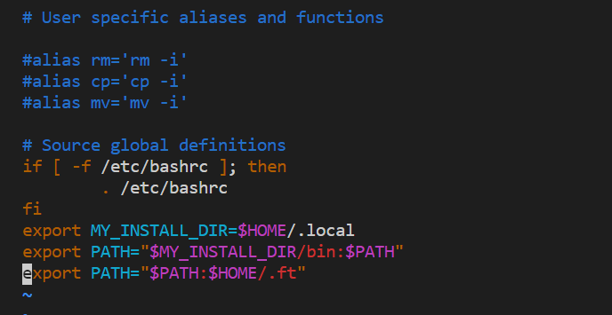

# gRPC使用指南
## 环境配置

[gRPC and Protocol Buffers安装](https://grpc.io/docs/languages/cpp/quickstart/)

其中的两条export命令，只对当前终端有效
```bash
$ export MY_INSTALL_DIR=$HOME/.local
$ export PATH="$MY_INSTALL_DIR/bin:$PATH"
```
为了方便，可以将这两条export写到 ``~/.bashrc`` 中



之后运行以下命令使配置生效

```bash
$ source ~/.bashrc
```


## 编译运行demo

运行脚本 ``no_proxy_add.py``，该脚本只需要运行一次，以后编译运行项目的时候无需再次运行。

```bash
$ python no_proxy_add.py
$ source /etc/bashrc
```

在 ``gRPC_demo`` 目录下，运行以下命令

```bash
$ mkdir -p cmake/build
$ cd cmake/build
$ cmake -DCMAKE_PREFIX_PATH=$MY_INSTALL_DIR ../..
$ make
```

在 ``gRPC_demo/cmake/build`` 下会生成  ``client-syn server-syn client-asyn server-asyn``  这四个可执行文件，前两个表示执行同步请求数据的客户端和服务端，后两个表示执行异步请求的客户端和服务端。同步和异步之间可以混用，例如：

```bash
./client-syn
./server-asyn
```

或者

```bash
./client-asyn
./server-syn
```


## 按需修改demo

**demo.proto**

此文件定义了用于通信的数据格式以及用于服务的具体函数，demo中以 ``GetNameService`` 为例展示了如何定义一个服务、服务下的具体函数以及消息格式，以实现从服务器上获取Name

### 同步RPC

**client-syn.cpp**

实现同步RPC通信的客户端源文件。关键调用为58行，执行后会阻塞直到收到服务器端的消息回复。

```c++
Status status = stub_->GetName(&context, request, &reply);
```

**server-syn.cpp**

实现同步RPC通信的服务端源文件。46~52行为服务端针对客户端的GetName调用所定义的具体操作。

### 异步RPC

异步RPC的通知机制为：客户端发起异步调用请求，之后由gRPC负责将请求结果保存到客户端定义的

**client-asyn.cpp**

实现异步RPC通信的客户端源文件。92~99行为

